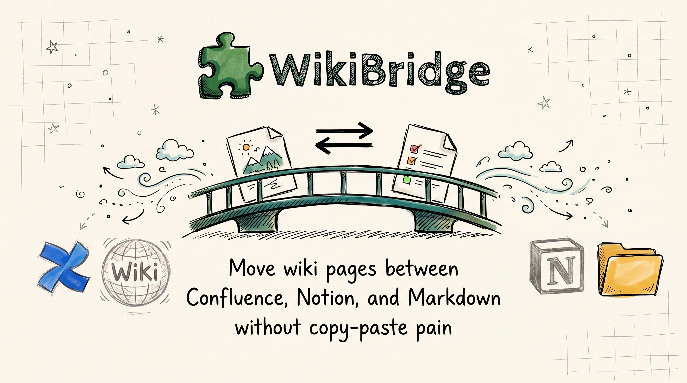

# WikiBridge

WikiBridge is a Chrome extension that lets you capture and publish wiki content across the tools. One click in the side panel and your page travels to wherever you need it next.

See [`docs/`](docs/agent/architecture) for architecture and design.
